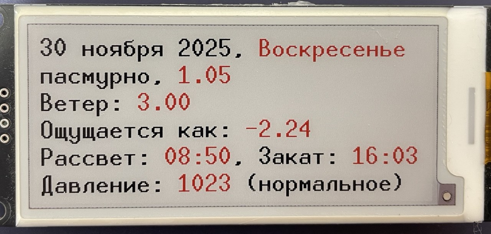

# ESP8266-Weather-EPaper



## Описание проекта
Проект представляет собой метеостанцию на базе ESP8266 с 2.9" трёхцветным e-paper дисплеем (SSD1680). Устройство получает текущую погоду с [OpenWeatherMap](https://openweathermap.org/), синхронизирует время по NTP, а также предоставляет режим точки доступа (AP) для первоначальной настройки WiFi и API-ключа. Настройки сохраняются в EEPROM, что позволяет сохранять параметры между перезагрузками.

## Функциональные возможности
- **Отображение данных:** Информативный вывод данных на e-paper дисплее, включая текущую погоду, температуру, скорость ветра, атмосферное давление, время рассвета и заката.
- **Получение данных о погоде:** Запрос текущей погоды через API OpenWeatherMap.
- **Синхронизация времени:** Использование NTP-серверов для получения точного времени.
- **Подключение к WiFi:** Работа в режиме станции (STA) с автоматическим переходом в режим точки доступа (AP) при отсутствии соединения.
- **Конфигурация через веб-интерфейс:** Позволяет задавать SSID, пароль и API-ключ через встроенный HTTP-сервер.

## Отображаемая информация
На дисплее отображается следующая информация:
- Дата и день недели
- Описание погоды и текущая температура
- Скорость ветра
- Температура "ощущается как"
- Время рассвета и заката
- Атмосферное давление с характеристикой (низкое, нормальное, повышенное, высокое)

## Требования
### Аппаратное обеспечение
- Микроконтроллер ESP8266 (Wemos D1 Mini)
- E-paper дисплей 2.9" SSD1680 (трёхцветный)


### Программное обеспечение и библиотеки
Для сборки проекта требуется:
- **Arduino IDE 2** или другая совместимая среда 
- Установленные библиотеки (через Arduino Library Manager):
  - `ESP8266WiFi` – для подключения к WiFi.
  - `ESP8266HTTPClient` – для HTTP-запросов.
  - `ArduinoJson` – для парсинга JSON-ответов.
  - `GxEPD2` – для управления e-paper дисплеем.
  - `U8g2_for_Adafruit_GFX` – для отрисовки текста на дисплее.
  - `ESP8266WebServer` – для работы в режиме точки доступа.
  - `EEPROM` – для сохранения настроек.

**Примечание:** Проект оптимизирован для ESP8266 и использует только текущую погоду (без прогноза)


### Схема подключения дисплея к Wemos D1 mini


| Пин на дисплее         | Функция         | Подключаемый пин Wemos D1 mini | GPIO      | Примечание                     |
|------------------------|-----------------|-------------------------------|-----------|--------------------------------|
| **busy**               | Сигнал занятости| D2                            | GPIO4     | Используется для ожидания готовности дисплея |
| **res**                | Сброс (Reset)   | D4                            | GPIO2     | Сигнал сброса дисплея          |
| **d\c**                | Data/Command    | D3                            | GPIO0     | Переключение режима данных/команд |
| **cs**                 | Chip Select     | D8                            | GPIO15    | Выбор устройства SPI           |
| **scl**                | SPI Clock       | D5                            | GPIO14    | Аппаратный SPI SCK             |
| **sda**                | SPI Data (MOSI) | D7                            | GPIO13    | Аппаратный SPI MOSI (передача данных) |
| **gnd**                | Земля           | GND                           | -         | Общий провод                   |
| **vcc**                | Питание         | 3.3V                          | -         | Питание дисплея (важно 3.3V, не 5V) |


### Прошивка  
1. **Клонирование репозитория:**
   ```bash
   git clone https://github.com/sevolord/ESP8266-Weather-EPD.git
   ```
2. **Открытие проекта:**
   - Откройте проект в Arduino IDE или другой выбранной среде.
3. **Установка библиотек:**
   - Установите все необходимые библиотеки через Arduino Library Manager или скачайте их с официальных репозиториев.
4. **Настройка:**
   - По умолчанию в коде заданы значения для SSID, пароля и API-ключа. При первом запуске, если устройство не сможет подключиться к сети, оно перейдёт в режим точки доступа с именем `ESP_Config`, где через браузер можно задать новые параметры.
5. **Компиляция и прошивка:**
   - Выберите соответствующую плату (ESP8266) и порт в Arduino IDE.
   - Скомпилируйте проект и загрузите прошивку на устройство.

## Использование
- **Режим STA:** Если устройство успешно подключается к указанной WiFi сети, оно получает данные о текущей погоде и отображает их на дисплее.
- **Режим AP:** При неудачном подключении устройство создаёт свою WiFi сеть `ESP_Config`. Подключитесь к ней и откройте в браузере [http://192.168.4.1](http://192.168.4.1) для ввода настроек.
- **Обновление данных:** Период обновления установлен на 1 час. Все данные о погоде и времени обновляются автоматически.
- **Настройка города:** Город для запроса погоды можно изменить через веб-интерфейс в режиме AP или в файле `secrets.h`.

## Структура репозитория
- **Основной исходный код:** Все файлы с исходным кодом проекта (`.ino`).
- **README.md:** Данное описание проекта.
- **LICENSE:** Файл с выбранной лицензией (MIT).
- **.gitignore:** Конфигурация для исключения временных файлов, артефактов сборки и файлов IDE.
- **Дополнительная документация:** Схемы подключения, инструкции по настройке и другие вспомогательные файлы.

## Используемые библиотеки и лицензии
Проект использует сторонние библиотеки, лицензии которых действуют отдельно:
- **ESP8266WiFi** – лицензия Espressif Systems.
- **ESP8266HTTPClient** – лицензия Espressif Systems.
- **ArduinoJson** – лицензия MIT.
- **GxEPD2** – лицензия MIT.
- **U8g2_for_Adafruit_GFX** – лицензия MIT.
- **ESP8266WebServer** – лицензия Espressif Systems.
- **EEPROM** – лицензия Arduino.

Убедитесь, что вы ознакомлены с лицензиями используемых библиотек и соблюдаете их условия.

## Лицензия
Данный проект распространяется под лицензией **MIT**. Подробнее см. в файле [LICENSE](LICENSE).

## Контрибьютинг
Если у вас есть предложения или улучшения:
- Форкайте репозиторий.
- Создайте новую ветку (`feature/your-feature`).
- Внесите изменения и отправьте pull request для обсуждения.

## Поддержка и обратная связь
Если возникли вопросы или проблемы при сборке/использовании:
- Откройте issue в репозитории.
- Свяжитесь с автором проекта.

---

*Автор: Всеволод дребнев*  
*Дата: 2025-11-30*
